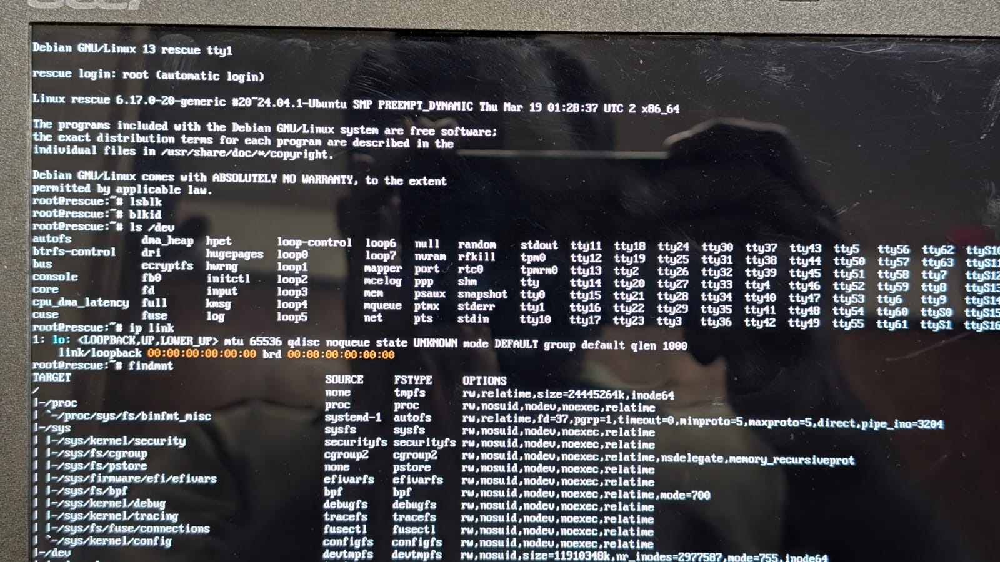

# rescue-efi

A single self-contained EFI binary that boots a full Debian rescue environment entirely from RAM.

Drop `rescue.efi` onto any UEFI machine — no installer, no USB formatting tool, no network
required at boot time. The kernel, rootfs, and all tools are packed into one file.



---

## Quick install

Builds `rescue.efi` on your machine (~15 min on first run). Requires Debian or Ubuntu, x86_64.

```bash
curl -fsSL https://raw.githubusercontent.com/prithivirajasingh5/uki/master/install.sh | bash
```

The script clones this repo, installs any missing build dependencies, and runs `make all`.
It will prompt for your sudo password when the build starts (debootstrap and kernel module
copy need root).

Output: `~/rescue-efi/rescue.efi`

---

## Put it on a USB stick

You need a USB drive with a FAT32 EFI System Partition (ESP). Most existing bootable USB
sticks already have one; you can also create one with `parted` + `mkfs.fat`.

```bash
# Find the ESP mount point, e.g. /media/you/EFI
cp rescue.efi /media/you/EFI/EFI/BOOT/BOOTX64.EFI

# Or copy to an existing ESP already mounted at /boot/efi:
sudo cp rescue.efi /boot/efi/EFI/rescue/rescue.efi
sudo efibootmgr --create --disk /dev/sda --part 1 \
    --label "Rescue EFI" --loader '\EFI\rescue\rescue.efi'
```

Then select it from your UEFI firmware boot menu (usually F12 or F2 at POST).

---

## What's inside

| Category | Tools |
|---|---|
| Partitioning | `parted`, `gdisk` |
| Filesystems | `btrfs-progs`, `e2fsprogs`, `dosfstools`, `xfsprogs`, `ntfs-3g`, `exfatprogs` |
| Encryption / LVM | `cryptsetup`, `lvm2` |
| NVMe | `nvme-cli` |
| Disk health | `smartmontools`, `testdisk`, `ddrescue` |
| EFI boot repair | `efibootmgr`, `grub-efi-amd64-bin` |
| WiFi | `iwd` + `iproute2` (no wpa_supplicant needed) |
| Networking | `dhclient`, `ping`, `traceroute`, `nc`, `tcpdump`, `ethtool`, `dig` |
| Remote access | `openssh-client`, `rsync` |
| Hardware info | `lshw`, `dmidecode`, `pciutils`, `usbutils` |
| Editors | `nano`, `vim-tiny` |
| Utilities | `curl`, `less`, `file`, `find`, `htop`, `lsof`, `strace` |

Type `readme` at the rescue shell for a quick reference card.

---

## Manual build

```bash
git clone https://github.com/prithivirajasingh5/uki.git
cd uki
sudo make all
```

Intermediate steps if you want finer control:

```bash
sudo make deps       # check and install host build dependencies
sudo make rootfs     # debootstrap Debian into work/rootfs/  (~10 min)
     make squashfs   # compress to work/root.squashfs        (~1 min)
     make initramfs  # pack cpio.gz with init + squashfs     (~5 s)
     make uki        # ukify → rescue.efi                    (~5 s)
```

Each step is idempotent — make only reruns a step if its inputs are newer than its output.

### Targeting a specific kernel

By default the build uses the latest kernel on the build host (`/boot/vmlinuz-*`).
To target a specific version:

```bash
sudo make all KERNEL=/boot/vmlinuz-6.8.0-51-generic
```

---

## Requirements

- Debian or Ubuntu, x86_64 (build host)
- ~2 GB free disk space for the build tree
- ~512 MB RAM on the rescue target (more is better; the rootfs extracts into tmpfs)
- UEFI firmware on the rescue target (BIOS/MBR is not supported)

The `make deps` step installs these build-time packages automatically:
`debootstrap`, `squashfs-tools`, `systemd-ukify`, `busybox-static`

---

## How it works

```
rescue.efi  (PE/EFI binary — one file)
  ├── .linux   → kernel image (from build host)
  ├── .initrd  → cpio.gz containing:
  │    ├── /init          POSIX sh script (PID 1)
  │    ├── busybox        static binary: sh, mount, switch_root …
  │    ├── unsquashfs     extracts the rootfs
  │    └── root.squashfs  compressed Debian rootfs (~200 MB uncompressed)
  └── .cmdline → console=ttyS0,115200 console=tty0 quiet
```

On boot:
1. UEFI loads `rescue.efi` and hands off to the kernel
2. The kernel runs `/init` (our script)
3. `init` mounts a tmpfs at `/newroot`, extracts `root.squashfs` into it, then calls `switch_root`
4. systemd starts in the fully writable Debian environment

See [`docs/design.md`](docs/design.md) for the full design rationale.

---

## WiFi

```bash
iwctl
  station wlan0 scan
  station wlan0 get-networks
  station wlan0 connect "MyNetwork"
  quit

ip addr show wlan0   # verify IP (iwd handles DHCP automatically)
```

See [`docs/wifi-setup.md`](docs/wifi-setup.md) for hidden networks, static IP, and SSH.

---

## Secure Boot

`rescue.efi` is unsigned by default and will be rejected by firmware with Secure Boot enabled.
See [`docs/secure-boot-signing.md`](docs/secure-boot-signing.md) to generate a key, sign the
image, and enroll it via MOK without disabling Secure Boot.

---

## Rebuilding after changes

```bash
cd ~/rescue-efi
sudo make all          # rebuild everything
sudo make uki          # rebuild only the EFI (if rootfs/squashfs unchanged)
make clean             # remove all build artifacts
```

---

## License

MIT
